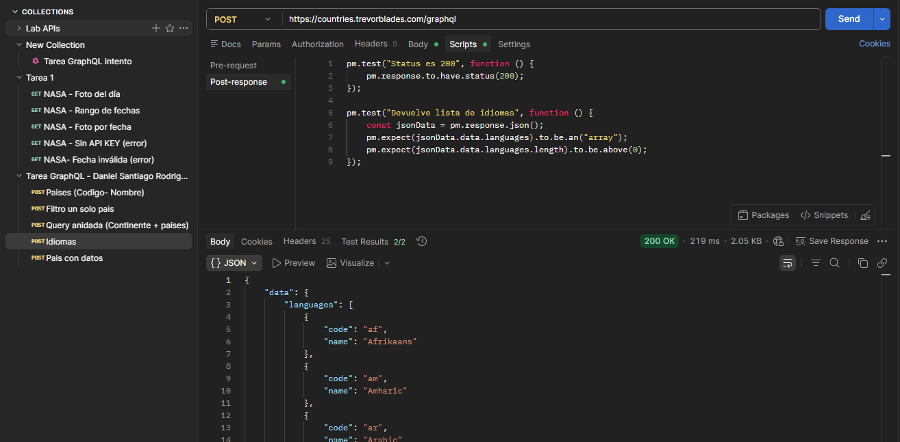

# 🧪 Taller APIs REST y GraphQL

## 👨‍💻 Estudiante
Daniel Rodríguez

---

# 🚀 PARTE 1 — API REST

## 📌 API elegida
NASA - Astronomy Picture of the Day (APOD)

---

## ❓ ¿Por qué elegí esta API?
Elegí la API de la NASA porque permite trabajar con autenticación mediante API Key, uso de query params y manejo de errores reales. Además, devuelve información interesante como imágenes astronómicas con descripciones detalladas.

---

## 📊 ¿Qué datos devuelve?
La API devuelve un objeto JSON con los siguientes campos principales:

- `date`: fecha de la imagen  
- `title`: título  
- `explanation`: descripción  
- `url`: enlace de la imagen  
- `media_type`: tipo de contenido (imagen o video)  

---

## 🔐 ¿Usa token?
Sí, utiliza una API Key.

- Tipo: API Key  
- Forma de uso: se envía como query param (`api_key=DEMO_KEY`)  

---

## 📡 Requests realizados

### 🔹 1. GET - Foto del día
📸 **Captura:**

---

### 🔹 2. GET - Foto por fecha (query param)
📸 **Captura:**

---

### 🔹 3. GET - Rango de fechas
📸 **Captura:**

---

### 🔹 4. GET - Sin API Key (error)
📸 **Captura:**
.png)

---

### 🔹 5. GET - Fecha inválida
📸 **Captura:**
.png)

---

## 📈 Códigos de estado obtenidos

| Request | Código |
|--------|--------|
| GET foto del día | 200 |
| GET por fecha | 200 |
| GET rango | 200 |
| Sin API Key | 403 |
| Fecha inválida | 400 |

---

## 🧠 ¿Qué aprendí diferente a JSONPlaceholder?

- Uso de autenticación real (API Key)
- Manejo de errores reales (400, 403)
- Uso de query params dinámicos
- Estructuras de respuesta no simuladas
- Necesidad de adaptar tests según la API

---

# 🌍 PARTE 2 — GRAPHQL

## 🔗 API utilizada
https://countries.trevorblades.com/graphql

---

## 📡 Requests realizados

### 🔹 1. Obtener países
📸 **Captura:**
.png)

---

### 🔹 2. Obtener país por código (CO)
📸 **Captura:**

---

### 🔹 3. Obtener continente con países (query anidada)
📸 **Captura:**
.png)

---

### 🔹 4. Obtener idiomas
📸 **Captura:**

---

### 🔹 5. Obtener país completo (US)
📸 **Captura:**

---

## ⚖️ Diferencias entre REST y GraphQL

| REST | GraphQL |
|------|--------|
| Múltiples endpoints | Un solo endpoint |
| Overfetching (datos extra) | Solo se pide lo necesario |
| Varias peticiones | Una sola query |
| Estructura fija | Flexible |

---

## 🔄 ¿Cuántos requests REST reemplaza?

La query anidada (continente + países) reemplaza aproximadamente entre **2 y 3 requests REST**, ya que en REST se necesitarían múltiples endpoints para obtener esa información.

---

## 💡 ¿En qué proyecto real usaría GraphQL?

Usaría GraphQL en:

- Aplicaciones móviles (optimización de datos)
- Dashboards interactivos
- Sistemas con datos altamente relacionados
- Aplicaciones donde se requiere eficiencia en las consultas
